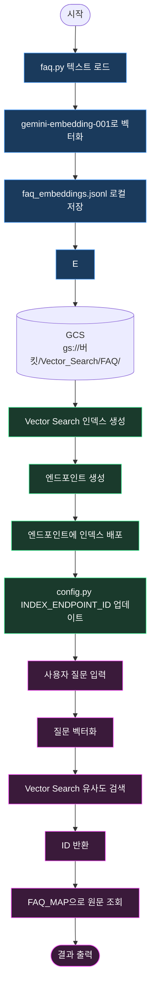
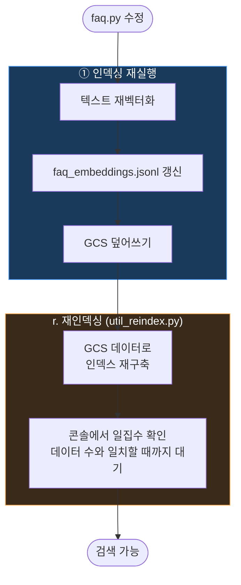

# FAQ Vector Search 순서도

## 최초 구축

---

## 데이터 변경 시

---

## ⚠️ 주의사항

| 상황 | 증상 | 해결 |
|------|------|------|
| 프로비저닝을 인덱싱보다 먼저 실행 | 빈 인덱스 생성, 검색 결과 없음 | 인덱싱 후 `r. 재인덱싱` 실행 |
| GCS 버킷 리전 불일치 | `FailedPrecondition 400` 에러 | 버킷을 `asia-northeast3`으로 새로 생성 |
| 재인덱싱 직후 바로 검색 | 빈 결과 반환 | 콘솔에서 일집수 확인 후 검색 |
| INDEX_ENDPOINT_ID 미업데이트 | `NotFound 404` 에러 | 프로비저닝 후 출력된 ID로 config.py 수정 |
